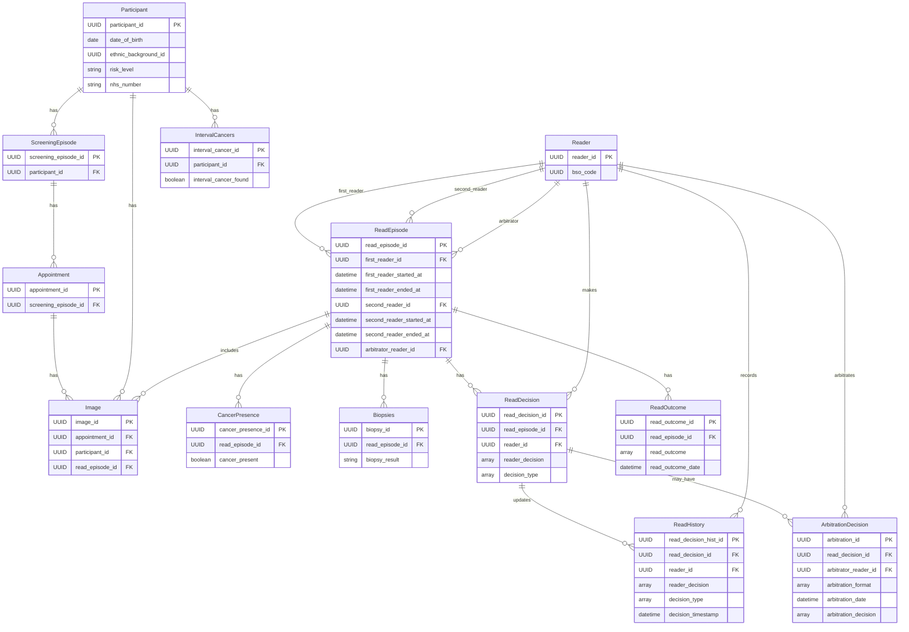

# Image Reading Data Model Diagram

```mermaid
erDiagram
    Participant {
        UUID participant_id PK
        date date_of_birth
        UUID ethnic_background_id
        string risk_level
        string nhs_number
    }

    ScreeningEpisode {
        UUID screening_episode_id PK
        UUID participant_id FK
    }

    Appointment {
        UUID appointment_id PK
        UUID screening_episode_id FK
    }

    Image {
        UUID image_id PK
        UUID appointment_id FK
        UUID participant_id FK
        UUID read_episode_id FK
    }

    Reader {
        UUID reader_id PK
        UUID bso_code
    }

    ReadEpisode {
        UUID read_episode_id PK
        UUID first_reader_id FK
        datetime first_reader_started_at
        datetime first_reader_ended_at
        UUID second_reader_id FK
        datetime second_reader_started_at
        datetime second_reader_ended_at
        UUID arbitrator_reader_id FK
    }

    CancerPresence {
        UUID cancer_presence_id PK
        UUID read_episode_id FK
        boolean cancer_present
    }

    Biopsies {
        UUID biopsy_id PK
        UUID read_episode_id FK
        string biopsy_result
    }

    IntervalCancers {
        UUID interval_cancer_id PK
        UUID participant_id FK
        boolean interval_cancer_found
    }

    ReadDecision {
        UUID read_decision_id PK
        UUID read_episode_id FK
        UUID reader_id FK
        array reader_decision
        array decision_type
    }

    ReadHistory {
        UUID read_decision_hist_id PK
        UUID read_decision_id FK
        UUID reader_id FK
        array reader_decision
        array decision_type
        datetime decision_timestamp
    }

    ArbitrationDecision {
        UUID arbitration_id PK
        UUID read_decision_id FK
        UUID arbitrator_reader_id FK
        array arbitration_format
        datetime arbitration_date
        array arbitration_decision
    }

    ReadOutcome {
        UUID read_outcome_id PK
        UUID read_episode_id FK
        array read_outcome
        datetime read_outcome_date
    }

    Participant ||--o{ ScreeningEpisode : has
    ScreeningEpisode ||--o{ Appointment : has
    Appointment ||--o{ Image : has
    Participant ||--o{ Image : has
    ReadEpisode ||--o{ Image : includes

    Reader ||--o{ ReadEpisode : first_reader
    Reader ||--o{ ReadEpisode : second_reader
    Reader ||--o{ ReadEpisode : arbitrator

    ReadEpisode ||--o{ CancerPresence : has
    ReadEpisode ||--o{ Biopsies : has
    Participant ||--o{ IntervalCancers : has

    ReadEpisode ||--o{ ReadDecision : has
    Reader ||--o{ ReadDecision : makes

    ReadDecision ||--o{ ReadHistory : updates
    Reader ||--o{ ReadHistory : records

    ReadDecision ||--o{ ArbitrationDecision : may_have
    Reader ||--o{ ArbitrationDecision : arbitrates

    ReadEpisode ||--o{ ReadOutcome : has
```
